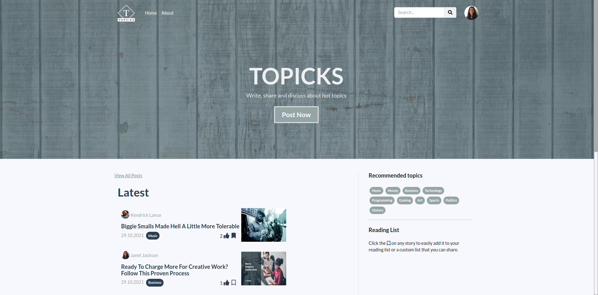

# TOPICKS
> Blog, created to read and share articles about variety of topics.



## Demo

https://dm-topicks.herokuapp.com/

## Features

- CRUD functionality for posts
- CRUD functionality for comments
- User dashboard
- User posts management
- User comments management
- Upload profile image
- Rich text editor
- Filter posts by topics
- Search posts
- Like posts
- Save post for later


## Tech Stack

**Client:** React, MobX, Bootstrap

**Server:** Node, Express , MongoDB


## Environment Variables

To run this project, you will need to add the following environment variables to your .env file

#### Server (create .env file in the project root folder)

`NODE_ENV`

`MONGO_URI`

`JWT_SECRET`

#### Client (create .env file in the client folder)

`REACT_APP_TINYMCE_API_KEY`

`REACT_APP_CLOUD_NAME`

`REACT_APP_CLOUDINARY_UPLOAD_PRESET`

## Installation

Clone the project

```bash
  git clone https://github.com/danimatuko/topicks.git
```

Install dependencies  (frontend & backend)

```bash
npm install
cd client
npm install
```

## Run

Run frontend (:3000) & backend (:5000)

```bash
npm run dev
```

Run frontend only (:3000)
```bash
npm run client
```

Run backend only (:5000)

```bash
npm run server
```
## Build & Deploy
Create frontend prod build  
```bash
cd client  
npm run build
```
There is a Heroku postbuild script, so if you push to Heroku, no need to build manually for deployment to Heroku

##  Api testing with Postman
Open postman and import the topicks.postman_collection.json file from  server/topicks.postman_collection.json

## 🔗 Links
[](https://dani-matuko.com/)
[](https://www.linkedin.com/in/dani-matuko/)
[](https://github.com/danimatuko)

